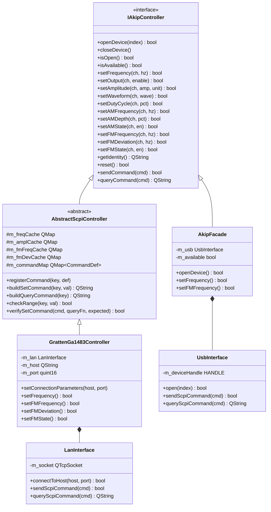
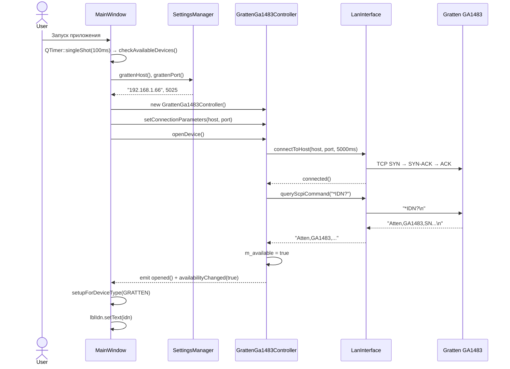
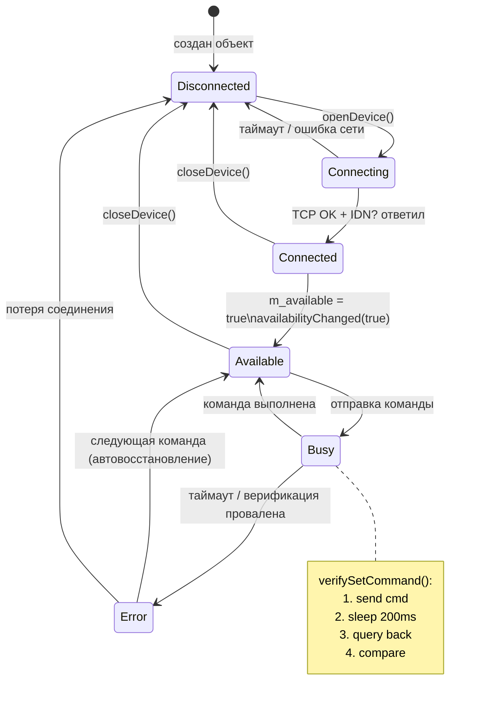
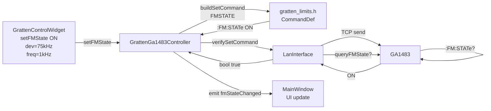
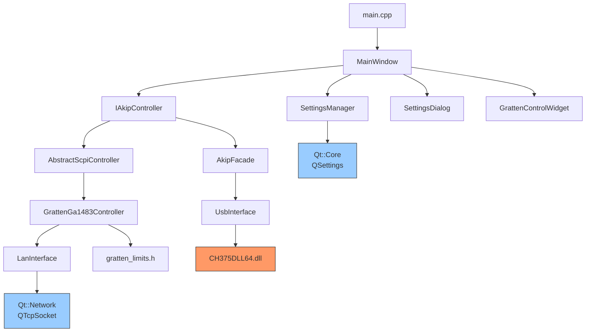

# Архитектурные диаграммы

Все диаграммы в формате [Mermaid](https://mermaid.js.org/) — рендерятся в GitHub, Obsidian, VS Code.

---

## 1. Иерархия классов



---

## 2. Диаграмма компонентов

```mermaid
graph TB
    subgraph UI ["UI Layer (Qt Widgets)"]
        MW[MainWindow\nmainwindow.h/cpp/.ui]
        GW[GrattenControlWidget\ngrattencontrolwidget.h/cpp/.ui]
        SD[SettingsDialog\nsettingsdialog.h/cpp/.ui]
    end

    subgraph Core ["Business Logic"]
        IF[IAkipController\niakipcontroller.h]
        AF[AkipFacade\nakipfacade.h/cpp]
        ASC[AbstractScpiController\nabstractscpicontroller.h/cpp]
        GC[GrattenGa1483Controller\ngrattenga1483controller.h/cpp]
        SM[SettingsManager\nsettingsmanager.h/cpp]
        GL[gratten_limits.h\ncommand dictionary]
    end

    subgraph Transport ["Transport Layer"]
        USB[UsbInterface\nusbinterface.h/cpp]
        LAN[LanInterface\nlaninterface.h/cpp]
    end

    subgraph HW ["Hardware"]
        AKIP[АКИП-3417\nUSB / CH375]
        GRTN[Gratten GA1483\nLAN TCP:5025]
    end

    subgraph SDK ["External SDK"]
        DLL[CH375DLL64.dll\nch375_sdk/]
    end

    MW --> IF
    MW --> SD
    MW --> GW
    GW --> IF
    SD --> SM
    MW --> SM

    IF <|-- AF
    IF <|-- ASC
    ASC <|-- GC
    GC --> GL

    AF --> USB
    GC --> LAN

    USB --> DLL
    USB --> AKIP
    LAN --> GRTN
    DLL --> AKIP
```

---

## 3. Последовательность: подключение к Gratten



---

## 4. Машина состояний: контроллер устройства



---

## 5. Поток данных: установка FM-модуляции



---

## 6. Дерево модулей и зависимостей


